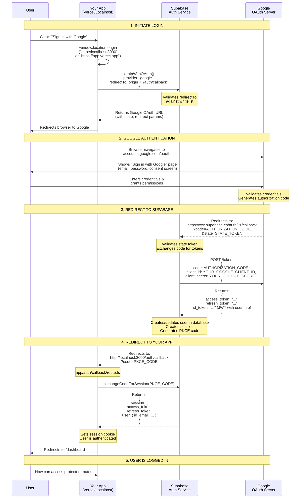

# Google OAuth Flow - Sequence Diagram

## Complete Authentication Flow
[


---

## Detailed Step-by-Step Explanation

### **Step 1: Initiate Login**

| # | Action | Details |
|---|--------|---------|
| 1 | User clicks button | `SignInWithGoogle.tsx` component |
| 2 | App gets current origin | `window.location.origin` (localhost or Vercel) |
| 3 | App calls Supabase | `signInWithOAuth()` with `redirectTo` parameter |
| 4 | Supabase validates | Checks if `redirectTo` is in allowed whitelist |
| 5 | Supabase returns URL | Google OAuth URL with state & redirect params |
| 6 | App redirects user | Browser navigates to Google |

**Example Google OAuth URL:**
```
https://accounts.google.com/o/oauth2/v2/auth?
  client_id=YOUR_GOOGLE_CLIENT_ID&
  redirect_uri=https://xxx.supabase.co/auth/v1/callback&
  response_type=code&
  scope=openid%20profile%20email&
  state=ENCRYPTED_STATE_TOKEN
```

---

### **Step 2: Google Authentication**

| # | Action | Details |
|---|--------|---------|
| 1 | User sees Google login | Standard Google sign-in page |
| 2 | User enters credentials | Email, password, 2FA if enabled |
| 3 | User grants permissions | Consent screen (if first time) |
| 4 | Google validates | Checks credentials |
| 5 | Google generates code | Creates authorization code (one-time use) |

---

### **Step 3: Redirect to Supabase**

| # | Action | Details |
|---|--------|---------|
| 1 | Google redirects | Sends user to Supabase callback URL |
| 2 | Supabase validates state | Ensures request is legitimate (CSRF protection) |
| 3 | Supabase exchanges code | Server-to-server call to Google |
| 4 | Google returns tokens | Access token, refresh token, ID token (JWT) |
| 5 | Supabase creates session | Stores user in database, creates session |

**Authorization Code:** One-time use, expires in ~10 minutes
**Access Token:** Used to access Google APIs (if needed)
**ID Token:** JWT containing user info (email, name, picture)

---

### **Step 4: Redirect to Your App**

| # | Action | Details |
|---|--------|---------|
| 1 | Supabase redirects | Sends user to your app's `/auth/callback` |
| 2 | App receives PKCE code | Short-lived code (not the Google code!) |
| 3 | App exchanges code | `exchangeCodeForSession()` call to Supabase |
| 4 | Supabase returns session | Access token, refresh token, user object |
| 5 | App sets cookie | Stores session for subsequent requests |
| 6 | App redirects to dashboard | User is now authenticated |

**PKCE Code:** Supabase-generated code (not the Google authorization code)
Purpose: Secure way to transfer session to your app

---

### **Step 5: User is Logged In**

User can now:
- Access protected routes
- Make authenticated API calls
- Session persists across page refreshes

---

## Important URLs in the Flow

### **1. Google OAuth URL** (Step 1 → 2)
```
https://accounts.google.com/o/oauth2/v2/auth
```
User sees Google's login page

### **2. Supabase Callback URL** (Step 2 → 3)
```
https://xxx.supabase.co/auth/v1/callback
```
Google sends authorization code here
**Must be in Google Cloud Console → Authorized redirect URIs**

### **3. Your App Callback URL** (Step 3 → 4)
```
http://localhost:3000/auth/callback
https://your-app.vercel.app/auth/callback
```
Supabase sends PKCE code here
**Must be in Supabase → Allowed Redirect URLs**

### **4. Final Destination** (Step 4 → 5)
```
http://localhost:3000/dashboard
https://your-app.vercel.app/dashboard
```
Where user lands after successful authentication

---

## Configuration Checklist

### **Google Cloud Console**
```
Authorized redirect URIs:
  ✅ https://your-project.supabase.co/auth/v1/callback
```

### **Supabase Dashboard**
```
Site URL:
  ✅ https://your-app.vercel.app

Redirect URLs:
  ✅ http://localhost:3000/auth/callback
  ✅ https://your-app.vercel.app/auth/callback
```

### **Your App (Vercel Environment Variables)**
```
  ✅ NEXT_PUBLIC_SUPABASE_URL=https://xxx.supabase.co
  ✅ NEXT_PUBLIC_SUPABASE_ANON_KEY=eyJ...
```

---

## Security Features

| Feature | Purpose | Where |
|---------|---------|-------|
| **State Token** | CSRF protection | Supabase generates, validates on callback |
| **PKCE Code** | Secure code exchange | Supabase generates, app exchanges for session |
| **Redirect Whitelist** | Prevent redirect attacks | Supabase validates allowed URLs |
| **Authorization Code** | One-time use | Google generates, Supabase consumes |
| **HTTPOnly Cookies** | XSS protection | Session stored securely |

---

## Common Issues & Solutions

### **Issue: Redirects to localhost on Vercel**
**Cause:** Vercel URL not in Supabase redirect whitelist
**Fix:** Add `https://your-app.vercel.app/auth/callback` to allowed URLs

### **Issue: "redirect_uri_mismatch" from Google**
**Cause:** Supabase callback URL not in Google authorized URIs
**Fix:** Add `https://xxx.supabase.co/auth/v1/callback` to Google Console

### **Issue: "Invalid redirect URL" from Supabase**
**Cause:** `window.location.origin` not in whitelist
**Fix:** Add both localhost and Vercel URLs to Supabase allowed redirects

---

## Code References

- **Sign in button:** `components/auth/SignInWithGoogle.tsx:6-11`
- **Callback handler:** `app/auth/callback/route.ts:4-29`
- **Supabase client:** `lib/supabase/client.ts`
- **Supabase server:** `lib/supabase/server.ts`

---

## Testing the Flow

### **Local Development:**
```bash
# Start app
npm run dev

# Navigate to
http://localhost:3000

# Click "Sign in with Google"
# Should redirect through Google and back to localhost:3000/dashboard
```

### **Production (Vercel):**
```bash
# Visit
https://your-app.vercel.app

# Click "Sign in with Google"
# Should redirect through Google and back to your-app.vercel.app/dashboard
```

---

## OAuth Flow Duration

| Step | Typical Time |
|------|--------------|
| App → Supabase | ~100-200ms |
| Supabase → Google | Instant (redirect) |
| User authenticates | 2-10 seconds (user input) |
| Google → Supabase | ~200-500ms |
| Supabase token exchange | ~500-1000ms |
| Supabase → App | Instant (redirect) |
| App session exchange | ~100-200ms |
| **Total** | **~3-12 seconds** |

---

## Token Lifespans

| Token | Lifespan | Renewal |
|-------|----------|---------|
| **Authorization Code** | ~10 minutes | One-time use |
| **PKCE Code** | ~5 minutes | One-time use |
| **Access Token** | 1 hour | Refresh token |
| **Refresh Token** | 30 days (default) | New refresh token on use |
| **Session Cookie** | Based on access token | Auto-refreshed |

---

